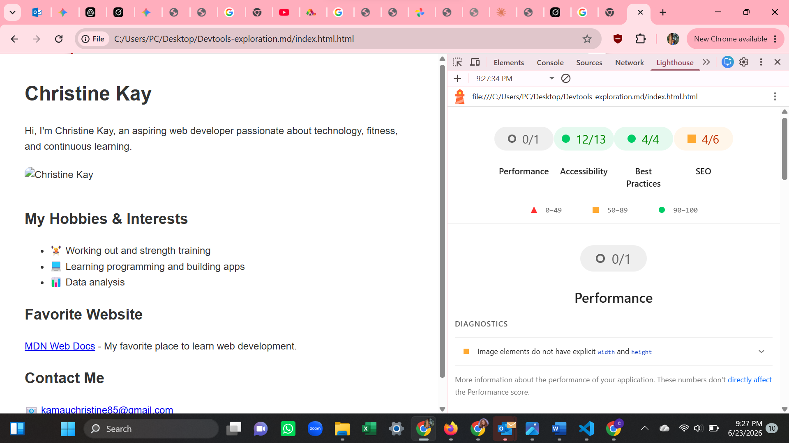

#  Accessibility Audit 

## Overview
I performed an accessibility audit on my personal webpage (`index.html`) using Chrome DevTools Lighthouse and WAVE Web Accessibility Tool.

## Issues Found (Before Fixes)
- Missing `<!DOCTYPE html>`
- Broken paragraph tag
- Insufficient alt text on image
- No `lang` attribute on `<html>` tag

## Fixes Applied

1. **Images** — Added descriptive alt text + explicit width and height
2. **Headings** — Proper hierarchy (h1 → h2)
3. **Links** — Used clear descriptive link text
4. **Language** — Added `lang="en"` to `<html>` tag
   

## Tools Used
- Chrome DevTools Lighthouse
- WAVE Web Accessibility Tool (Browser Extension)

## Final Lighthouse Accessibility Score
**Accessibility: 12/13** (Very Good)

## Screenshots

![Lighthouse Accessibility Score]

## Summary
